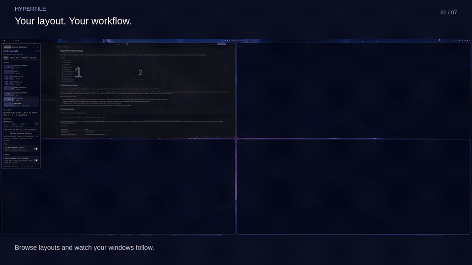
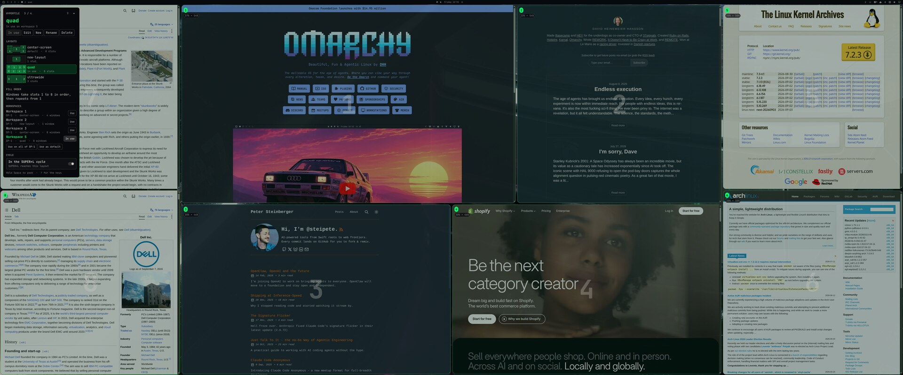
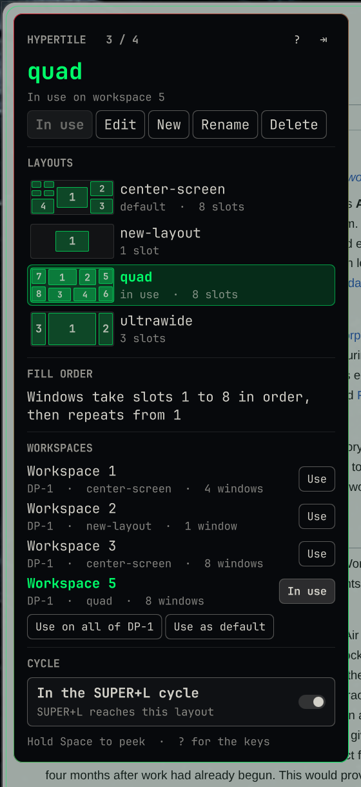
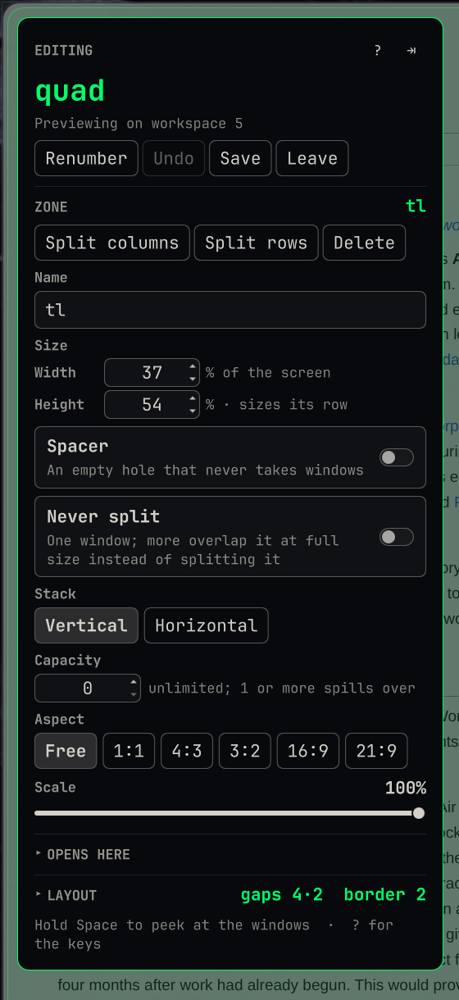
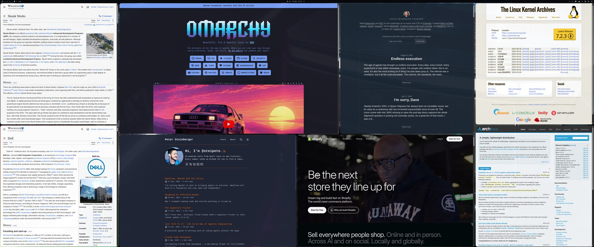
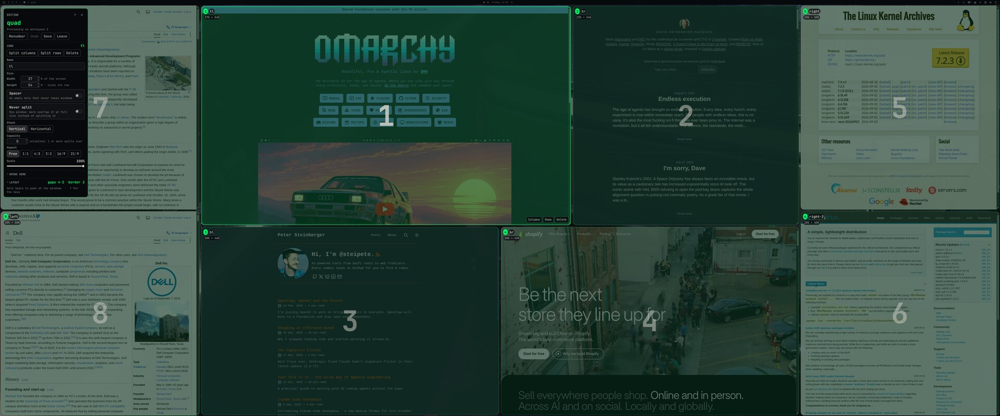

# Hypertile

Zone layouts for Hyprland on [Omarchy](https://omarchy.org/). Describe a
layout as zones ("20/60/20 columns, the center split in four, fill the
quadrants first, then the right column, then the left"), and Hyprland's Lua
layout API tiles windows into it. A fullscreen overlay draws the zones over
your real windows at true scale, so you browse layouts with the arrow keys
and slice, drag, and renumber them with the mouse. A bar widget shows the
layout on each monitor, `SUPER+L` cycles through your layouts, and a CLI
does everything the overlay does from a script.

Requires Omarchy 4 (the Lua Hyprland config and the Omarchy shell);
developed against Hyprland 0.56.2 / Omarchy 4.0.3. Local validation uses the
`0.56.2-2.1` size-ack backport described in the
[sizing diagnostics](docs/HYPRLAND-SIZING-BUG.md); it is installed separately.
`lua`, `jq`, and Python 3 ship with Omarchy.





<p>



</p>

## Install

```bash
omarchy plugin add https://github.com/jdvmi00/hypertile.git
~/.config/omarchy/plugins/jmartin.hypertile/install.sh
```

The first line clones this repository into the Omarchy plugins directory,
where the shell loads the overlay and the bar widget. The second puts
everything else in place, and is the one to run again after every update:

- the engine and bridge into `~/.config/hypr/`, and the two shipped layouts
  into `~/.config/hypr/layouts/` (a layout that already exists is left alone)
- `hypertile-ctl` into `~/.local/bin/`
- the session recovery and independent Scenes services, started by the layout loader
- a `require("hypr.hypertile-layouts")` line in `hyprland.lua`
- the bar widget after the workspaces (skipped when it is already on the bar)
- a **Layouts** entry in the `SUPER+SPACE` menu (`--no-menu` skips it)
- guarded logout/reboot/shutdown menu actions that save the session before
  Omarchy closes windows (custom actions are left alone; `--no-menu` skips these)
- three keybinds (`--no-keybinds` skips them): `SUPER+ALT+L` opens the
  overlay; `SUPER+L` cycles the workspace through your layouts and then
  dwindle, replacing Omarchy's dwindle/scrolling toggle, which cannot
  return to a Lua layout; `SUPER+SHIFT+L` cycles the other way
- `SUPER+Arrow` focuses the nearest window in that direction. `SUPER+SHIFT+Arrow`
  moves to the next layout slot: an empty slot receives the active window, and an
  occupied slot swaps windows. Other apps stay in their slots; spacers and scene
  slots marked Empty are skipped. Moving into a collapsed slot reveals the full
  layout on that workspace until the layout is reset.

Every config file it edits is first copied to `<file>.hypertile.bak` if that
backup does not exist. Later installs and uninstalls preserve that first backup.
The installer then reloads Hyprland and checks `hyprctl configerrors`. Update with:

```bash
omarchy plugin update jmartin.hypertile
~/.config/omarchy/plugins/jmartin.hypertile/install.sh
```

Uninstall with:

```bash
~/.config/omarchy/plugins/jmartin.hypertile/uninstall.sh   # --purge also drops your layouts and state
omarchy plugin remove jmartin.hypertile
```

The uninstaller removes what the installer added, sets the default layout
back to dwindle if it pointed at a hypertile layout, and keeps your layouts
(`~/.config/hypr/layouts/`), state (`~/.local/state/hypertile/`), and saved scenes
(`~/.config/hypertile/scenes.json`) unless `--purge` is given. Purging also removes
the services' Python caches; session settings are kept. If a
custom binding still references `hypertile-navigation`, uninstall retains the
runtime files and asks you to remove that reference before running it again.

## Using it

**Hyprland 0.56.2 sizing bug:** after a layout switch or save, a window's
content can remain smaller than its tile. `hypertile-ctl heal` is temporary
recovery. A one-line compositor backport fixes the identified acknowledgment
bookkeeping defect. See [the sizing bug and backport guide](docs/HYPRLAND-SIZING-BUG.md)
for building/installing it, checking it after Omarchy updates, rollback, and
returning to an official package that includes the upstream correction.

| Where | What |
|---|---|
| `SUPER+L`, `SUPER+SHIFT+L` | next or previous layout on this workspace; the name flashes in the OSD |
| `SUPER+ALT+L`, the bar widget, `SUPER+SPACE` > Layouts | open the overlay |
| bar widget | the layout on this monitor's workspace; scroll or middle-click cycles |
| `hypertile-ctl list` | the layouts on disk, the one in use starred |

Layouts live one per file in `~/.config/hypr/layouts/<name>.lua`. A layout
saved from the overlay joins the `SUPER+L` cycle (every layout on disk in
name order, then dwindle); one saved with `in_cycle = false` is skipped by
the cycle and still shown by the overlay. Pressing `SUPER+L` several times
quickly flashes each name and switches once, to the layout you stop on. Each workspace remembers its
layout in `~/.local/state/hypertile/workspace-rules/`; the default for
workspaces without one is `general.layout` in `looknfeel.lua`.

## Session recovery

Hypertile saves the desktop after changes and restores supported applications
on the next Hyprland session. It restores zone layouts, native window order,
pins, runtime sizing, workspaces, floating geometry, and focus. Applications
restore their own tabs/documents; terminal commands are not replayed.

Use the guarded Omarchy menu actions or `hypertile-ctl session logout`,
`reboot`, or `shutdown` so the snapshot is saved before applications close.
`hypertile-ctl session status` reports progress and unmatched windows. Apps
with no launch recipe are skipped without holding anything up. A partial
restore (an app that failed to launch or whose window never appeared) protects
the original snapshot until you retry or explicitly accept the current desktop
with `hypertile-ctl session resume`; a notification says so, and again at
logout while saving is still paused.

`hypertile-ctl session save work` saves a named session; `session restore work`
returns to it. See [session recovery](docs/SESSIONS.md) for app recipes,
shutdown integration, storage, and limits.

## Overlay

A fullscreen layer draws the viewed layout's zones at true scale over your
windows. Each zone carries a badge with its position in the fill order (a
slot holding several positions shows "5 · 6" and a divider per stacked
window) and chips for its size and constraints. The inspector rail holds
the layout's name, the actions, and the settings for the current mode. It
docks on the left or the right and remembers that, along with which
sections are open, in `~/.local/state/hypertile/overlay.json`.

### Layouts tab

| Key | Action |
|---|---|
| arrows or `h` `j` `k` `l`, or a click in the rail's list | browse the layouts on disk; the workspace follows |
| `Enter` | use the viewed layout on this workspace and close |
| `Esc`, click outside | close; the workspace goes back to the layout it had |
| `Space` (hold) | peek: the overlay fades to hairlines |
| `e` | edit the viewed layout |
| `n` | new layout, blank or a copy of the viewed one |
| `F2` | rename (workspace rules and the default follow) |
| `d` | delete, after a confirmation |
| `r` | re-read the layouts and the workspace |
| `?` | show or hide the keys in the rail |

Browsing switches the workspace for real, without persisting: each step is
a compositor-only switch, debounced behind the keys so a held arrow lands
once, and the scrim lightens so the windows show through. The default
layout cannot be deleted; workspaces whose rule pointed at a deleted layout
fall back to the default. The rail's **Workspaces** section uses the viewed
layout on any workspace, on every workspace of a monitor, or as the
default, and keeps the overlay open.

### Scenes tab

Switch to **Scenes** to choose what each zone holds: **Local windows**, **Empty**,
an open window, or an installed app. Click a zone, press its fill number outside
the search field, or use `Tab` to select it. Type to search; app names can start
with digits. `↑`/`↓` select a match, `Enter` assigns it, and `Tab` moves to the
next zone while keeping the query. `Esc` clears a query first, then closes;
`?` shows the keys. Ordinary letters, including `hjkl`, remain search text.

With no zone selected, `↑`/`↓` browse saved scenes, `Enter` uses the selected
scene, and `Delete` asks before removing its file (`Enter` confirms, `Esc`
cancels). **Save** updates the named scene; **Save as…** stores another one.
Using a saved scene asks before replacing unsaved scene changes. **Retry**
rechecks pending content, and **Restore previous** returns to the arrangement
from before the scene. Clicking outside the zones deselects first; a second
click closes. See [Scenes and content](docs/SCENES.md) for placement, recovery,
and app identity details.

### Edit mode

Edits preview live on an unmanaged workspace. When a workspace has assigned
content, preview stays off: saving an existing layout applies the changes, and
saving a new layout asks before using it and replacing those assignments.



| Key | Action |
|---|---|
| click, arrows or `hjkl`, `Tab` | select a zone |
| `c`, `r` | split the selected zone into columns or rows |
| `x`, `Delete`, right-click | delete it; the neighbour absorbs the space |
| drag a divider | resize the two zones it separates |
| `Shift` + arrows | move the selected zone's edge by 1% of the screen |
| `s` | toggle spacer (an empty hole that never takes windows) |
| `f` | renumber: click zones in fill order, `Backspace` undoes, `Enter` finishes |
| `u` | undo |
| `w`, `Ctrl+S` | save (a new layout asks for a name) |
| `Esc` | leave; with unsaved changes it asks: Discard, Save, or keep editing |

The rail's **Zone** section names the selected zone (names matter in the
file and for app rules, so view mode does not show them), sets its exact
size in percent of the screen, and its options: spacer; never split (one
window at most, never an overflow target while another zone exists);
stack direction; capacity; aspect ratio (1:1, 4:3, 3:2, 16:9, 21:9) and
scale, so one zone with 1:1 at 70% is a square in the middle of the
screen. **Opens here** lists the apps pinned to the zone, picked from the
windows open now; an app allowed in several zones fills them lowest number
first. **Layout** sets the gutters (the gap between windows, the gap
around the layout, the border), the window corner radius for the layout's
workspaces, the empty and lone-window policies, and whether the layout is
in the `SUPER+L` cycle.

Zones you did not click while renumbering follow the clicked ones in tree
order. Discarding an unmanaged edit previews the saved layout back onto the
workspace; nothing reloads. Discarding managed edits leaves the workspace as it was. Gutters and rounding travel with the layout as
workspace and window rules, and that rule write is the whole switch (see
`docs/INTERNALS.md`).

### Scripting

While the overlay is open, `omarchy-shell hypertile <method> [args]` drives
it:

| Method | Effect |
|---|---|
| `next`, `prev`, `view <name>` | browse |
| `use`, `apply`, `applyTo <ws>`, `applyMonitor <mon>`, `setDefault` | use the viewed layout (`use` closes) |
| `inCycle <bool>`, `rename <name>`, `deleteLayout` | layout housekeeping |
| `edit`, `newLayout`, `newBlank` | enter edit mode (copy or blank) |
| `select <zone>`, `move <dir>`, `split <zone> <columns\|rows>`, `remove <zone>` | zones |
| `nudge <w\|h> <delta>`, `size <zone> <w\|h> <fraction>`, `resize <path> <index> <ratio>` | sizes |
| `renameZone <zone> <name>`, `renumber <a,b,c>`, `zoneProp <zone> <key> <value>`, `capacity <zone> <n>` | zone settings |
| `layoutProp <key> <value>`, `gap <inner\|outer> <px>`, `addRule <class> <zone>`, `removeRule <i>` | layout settings |
| `undo`, `saveAs <name>`, `discard` | finish an edit |
| `content <bool>` | show Scenes (`true`) or Layouts (`false`); leave edit mode first |
| `assign <local\|empty>` | set the selected zone to local fill or empty |
| `assignApp <class>` | pin an already-open window of this class to the selected zone; does not launch an app |
| `scene <action> <name>` | request a scene action on the current workspace; see actions below |
| `saveSceneAs`, `saveScene <name>`, `deleteScene <name>` | open the scene naming field, save directly, or delete directly |
| `confirmSwitch` | confirm the pending layout or scene replacement |
| `search <text>`, `pick` | set the app query, then assign the selected search match |
| `hover <index>`, `focusSearch` | preview a search match by zero-based index (`-1` clears), or focus the search field |
| `dock <left\|right>`, `keysHint <bool>`, `peek <bool>`, `refresh`, `close` | the overlay itself |
| `viewed`, `draft`, `state` | read back the viewed name, the draft, or the whole state as JSON |

For content assignments, switch to Scenes and select a zone first. `assignApp`
accepts a window class; to launch or reuse an installed app, use `search` and
`pick`. `scene` actions include `apply`, `save`, and `remove` with a scene name,
or `retry`, `restore`, and `dismiss` with an empty name argument (`""`). Use
`state` to inspect `pendingSwitch`, scene progress, or errors; `confirmSwitch`
accepts a pending replacement. `deleteScene` removes the saved definition
immediately, without the UI's confirmation prompt.

```bash
omarchy-shell hypertile content true
omarchy-shell hypertile select left
omarchy-shell hypertile search '1Password'
omarchy-shell hypertile state  # check that matches is greater than zero
omarchy-shell hypertile pick
omarchy-shell hypertile state
```

Replace `left` with a zone name from your layout. Placement may continue after
the command returns; read `state` to check its result.

## Bar widget

An **!** badge means session saving needs attention. The tooltip explains why;
open the overlay to see unmatched windows or resume saving after a partial
restore or freeze. See [Session recovery](docs/SESSIONS.md).

The plugin's second kind: the layout icon and the name of the layout on
this monitor's active workspace, one instance per monitor. Click opens the
overlay; the scroll wheel or a middle-click cycles. It follows workspace
focus, workspaces moving between monitors, and config reloads on its own,
and `hypertile-ctl` pokes it after every apply, since a workspace rule
write raises no compositor event. `omarchy bar move jmartin.hypertile
--section center` moves it. The shell tracks the plugin by that one bar
entry, so `omarchy plugin disable jmartin.hypertile` drops the overlay too.

## CLI

```
hypertile-ctl list [--json]            layouts on disk, the one in use starred; --json includes each spec
hypertile-ctl dump <name>              layout as JSON  {"name":..., "spec":{...}}
hypertile-ctl validate [file|-]        check JSON, silent on success
hypertile-ctl save [file|-] [--no-reload]
                                       write layouts/<name>.lua, reload
hypertile-ctl rename <old> <new> [--no-reload]
                                       rename the file; workspace rules and the default follow
hypertile-ctl remove <name> [--force] [--no-reload]
                                       delete the file, reload; refuses the default, and a layout
                                       a workspace rule uses unless --force drops those rules
hypertile-ctl preview [file|-] [--workspace N] [--no-apply]
                                       hot-swap in the compositor and re-place the workspace, no disk write
hypertile-ctl apply <name|dwindle|scrolling|master> [--workspace N] [--quiet] [--no-persist]
                                       workspace rule, persisted in ~/.local/state/hypertile/workspace-rules/;
                                       the shell flashes the name (unless --quiet, or the workspace is
                                       not the active one) and the bar widget refreshes; --no-persist
                                       switches the compositor only
hypertile-ctl cycle [--reverse] [--workspace N] [--quiet] [--now]
                                       apply the next layout: every saved layout in name order
                                       (in_cycle = false skips one), then dwindle; presses within
                                       200 ms become one switch to the layout landed on (--now
                                       switches at once)
hypertile-ctl heal [--workspace N]     manual recovery for a window drawn smaller than its tile
hypertile-ctl current [--json]         active workspace id, name, layout; --json adds monitor size,
                                       reserved edges, gaps, border, layout area
hypertile-ctl workspaces [--json]      every workspace with monitor, layout, window count
hypertile-ctl windows [--json]         open windows (class, title, workspace)
hypertile-ctl default [name] [--no-reload]
                                       show or set the default layout (looknfeel.lua)
hypertile-ctl path [name]              layouts dir or a layout's file
```

Reading a layout back executes its file with a recording stub in place of
the engine, so hand-edited files round-trip as long as they are valid Lua.

## Spec

```lua
local hypertile = require("hypr.hypertile")

hypertile.layout("ultrawide", {
  columns = {
    { name = "left",   w = 0.2 },
    { name = "center", w = 0.6 },
    { name = "right",  w = 0.2, rows = { { name = "r1" }, { name = "r2", h = 2 } } },
  },
  -- leaf options: aspect = 1 (w/h), scale = 0.7, spacer = true, never_split = true, stack = "h"
  fill  = { "center", "right", "left" },   -- where the first unassigned windows go
  cycle = { "right", "left", "center" },   -- where the rest go (defaults to fill)
  rules = { { class = "^chromium$", slot = "center" }, { tag = "terminal", slot = "right" } },
  capacity = { r1 = 1 },                   -- overflow spills to the next fill slot
  gaps = { inner = 0, outer = 0 },         -- gutters, applied as workspace rules
  border = 0,                              -- border size, same
  rounding = 12,                           -- window corner radius 0..20, as a window rule
  empty  = "collapse",                     -- or "keep": empty slots leave a gap;
                                           -- any container node can override with its own `empty`
  single = "collapse",                     -- or "slot": one window stays in its slot
  stack  = "v",                            -- or "h": how windows share a slot
  in_cycle = false,                        -- leave out of the SUPER+L cycle (default true)
})
```

Use it from a workspace rule (`layout = "lua:ultrawide"`) or as the global
layout. Runtime commands go through the layout dispatcher:

```lua
hl.dsp.layout("pin center")        -- pin the active window to a slot
hl.dsp.layout("unpin")
hl.dsp.layout("grow center 0.05")  -- adjust a slot's weight
hl.dsp.layout("size center 1.0")
hl.dsp.layout("reset")
```

Two layouts ship:

- `ultrawide`: 20/60/20 columns, fill center, right, left, then cycle.
- `quad`: same columns, but the center is four quadrants filled top-left,
  top-right, bottom-left, bottom-right, then right (stacked), then left
  (stacked). Every slot keeps its place when empty, so a lone window sits
  in the top-left quadrant.

## Layout of this repository

```
manifest.json          the Omarchy plugin manifest (kinds: overlay, bar-widget)
plugin/                the shell plugin: Overlay.qml, Rail.qml (inspector), ZoneItem.qml,
                       Divider.qml, Thumb.qml, Card.qml, Chip.qml, Geometry.js (drawing),
                       Editor.js (edits); ContentPane.qml and Content.js (the Scenes tab);
                       LayoutWidget.qml (bar widget); SessionStatus.qml and Session.js
                       (session status); Readability.js (text contrast)
hypertile.lua          engine: spec -> layout provider (hot-swappable)
hypertile-bridge.lua   bridge: load/serialize/JSON/save/preview/apply
hypertile-json.lua     JSON encode/decode (pure Lua)
hypertile-layouts.lua  loader: requires every ~/.config/hypr/layouts/*.lua
hypertile-navigation.lua  gap-aware focus and swap for SUPER+arrows and SUPER+SHIFT+arrows
hypertile-session.lua  compositor adapter: capture and restore window placement
session/service.py    session watcher, durable snapshots, app launch and matching
session/scene_recovery.py  checkpoint and delivery of scene assignments across restarts
session/upgrade.py    preserve daemon state while replacing installed runtime files
scenes/*.py            scenes service: saved scenes, the app catalog, one-shot placement
layouts/*.lua          shipped layouts: ultrawide, quad
bin/hypertile-ctl      CLI over the bridge
bin/hypertile-session  session service entry point (also via hypertile-ctl session)
bin/hypertile-scenes   scenes service entry point (also via hypertile-ctl scene)
dev                    link the checkout, check changes, and reload affected components
install.sh             puts the engine, CLI, layouts, keybinds, and menu entry in place
uninstall.sh           takes them out again
probe.lua              live probe (logs everything the API hands a layout)
docs/README.md         development workflow, testing, and backup/recovery paths
docs/INTERNALS.md      what the compositor API does and does not do, what shapes the overlay,
                       and the stale-window forensics
CHANGELOG.md           release notes
test/                  engine, bridge, CLI, geometry, and editor tests
```

The overlay reads everything through `hypertile-ctl current --json` and
`hypertile-ctl list --json`, previews through `hypertile-ctl preview`, and
saves through `hypertile-ctl save` then `apply`. `Overlay.qml` owns the
state, the processes, and the pointer and key handling; `Rail.qml` is the
inspector, `ZoneItem.qml` draws a zone, `Divider.qml` a boundary,
`Thumb.qml` a layout thumbnail. The chrome uses the shell's `Color` and
`Style` tokens and its `qs.Ui` controls, so it follows the active theme.
Zone math lives in `plugin/Geometry.js`; edits are pure functions in
`plugin/Editor.js`.

## Development

For live development, keep one checkout and link the installed plugin to it:

```sh
./dev link       # preserves the existing installation, then links this checkout
./install.sh     # first-time runtime/config setup
./dev apply      # validates and applies changes; restarts affected components
./dev status
```

After setup, edit locally and run `./dev apply`. See the
[development README](docs/README.md) for component reloads, layout previews,
backup/recovery paths, and isolated testing. The regular installer also supports
an unlinked source checkout when the destination is a plain plugin copy; it
refuses to overwrite a different Git checkout.

Run the tests from the repository root:

```bash
lua test/harness.lua    # engine: placement, rules, capacity, messages, hot swap
python3 test/dev.py     # deployment: preservation, selective restarts, failure handling
python3 test/session.py # recovery: interrupted writes, shutdown, restart, identity
lua test/session.lua    # recovery adapter: window order, layout specs, against a fake compositor
lua test/bridge.lua     # bridge and CLI: JSON, round trips, save/list/remove, against a fake hyprctl
node test/geometry.js   # overlay drawing math
node test/editor.js     # editor operations, every result validated by the engine
omarchy plugin validate .
```

The harness also checks that the `ultrawide` spec places 1 to 9 windows
where the hand-written provider in `test/fixtures/legacy-ultrawide.lua`
put them (within 1px on stacked heights, where hypertile rounds edges
instead of sizes to avoid seams). The CLI runs from a checkout without
installing: `HYPERTILE_SRC=$PWD bin/hypertile-ctl list`.

## Remote desktops

Scenes can launch or reuse installed apps in named zones, including each
computer's Remote Desktops launcher. Placement happens once; subsequent window
moves and closes stay under your control. The independent Scenes service does
not own remote connections or host display settings.

Use the overlay’s **Scenes** tab or `hypertile-ctl scene` to assign apps, local
windows, or Empty, then save the arrangement. See [scenes and content](docs/SCENES.md)
for setup, migration from legacy stream sources, and recovery behavior.
Remote connections and host recovery now belong to
[Remote Desktops](https://github.com/jdvmi00/remote-desktops). Upgrade checks
require legacy connections to be disconnected and restored before removing
their old runtime files; saved configuration and journals are preserved.

## License

MIT. See [LICENSE](LICENSE).
