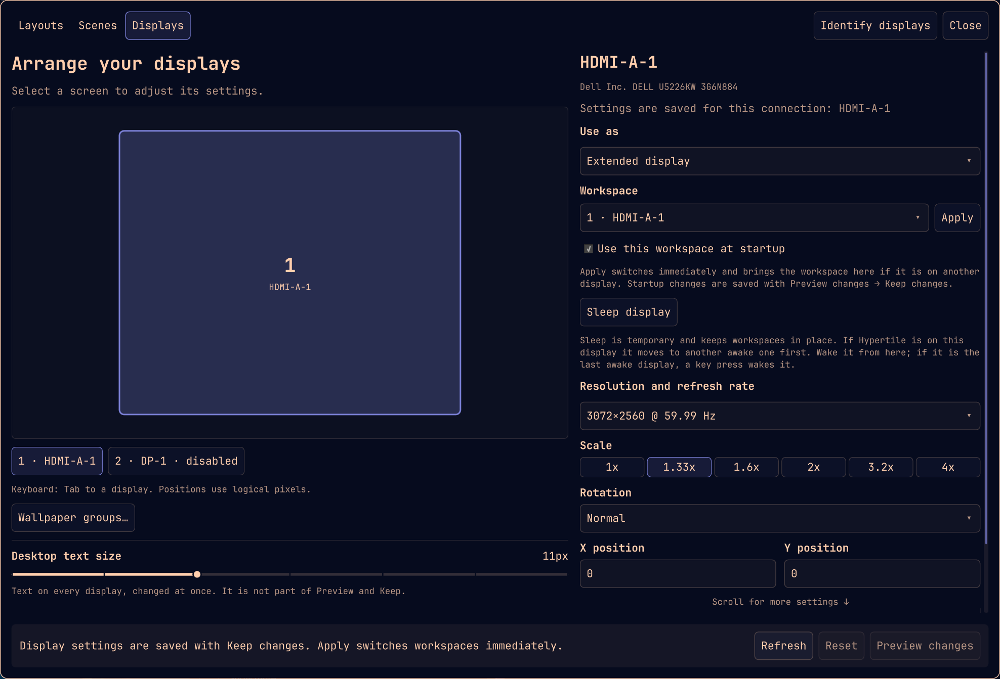

# Displays and workspace placement

Open Hypertile and choose **Displays**. The diagram uses logical desktop
coordinates: resolution, rotation, and scale all affect a screen's size. Drag a
screen to align its edges, or enter its X and Y position.



Screens are numbered by
position, left to right and then top to bottom, so the number on a screen says
where it stands; a mirror counts right after its source, and disconnected or
disabled displays come last. Tab to a diagram screen and use arrows to move one
logical pixel, or Shift+arrows for ten. **Identify displays** labels every
screen with its number for a few seconds, with the selected screen highlighted;
`hypertile-ctl display identify` does the same, or labels one screen when given
a connector. Closing with unsaved changes asks before discarding them; nothing is
applied until you preview.

Select a screen to change resolution and refresh rate, scale, rotation, or its
enabled state. The mode picker lists the modes reported by Hyprland. Saved
screens that are disconnected remain visible, with their preferences retained.
If screens report the same identity, explicitly match each connector before
applying. Hypertile does not guess which identical screen should inherit a
saved configuration.

Choose **Preview changes**, then **Keep changes** within 15 seconds. **Revert**,
closing during preview, or letting the countdown expire restores the previous
arrangement and workspace placement where possible. A separate watchdog runs
outside the overlay and display watcher. Confirmation is required even when
only workspace or layout preferences change. Unsupported modes and overlapping
independent screens produce an error before application.

## Mirroring

Select a display and choose **Use as → Mirror display …** to duplicate an
independent display. **Extended display** restores its separate desktop and
previous position; **Disabled** removes it from the desktop. Sleep remains a
separate temporary action.

The diagram groups mirrors with their source (for example, **1 + 2**). Select
individual physical displays from the list to change resolution and refresh.
Mirrors have no independent desktop position, initial workspace, or default
layout. Their saved workspace assignments temporarily use the source; their
independent preferences remain available when returning to Extended.

A mirror source must be connected, enabled, and independent. Multiple displays
can mirror one source, alongside other extended displays. Self-mirroring,
chains, and cycles are rejected. Different aspect ratios may stretch the image;
mirroring does not render extra detail for a higher-resolution target.

Mirroring uses the same preview countdown, Keep, and rollback as other display
changes. Keep writes the `mirror` field into the existing Lua declaration.
Returning to Extended explicitly clears that field. Recovery establishes source
displays first and keeps a remaining output usable if a source disappears.

## Sleep and disable

**Sleep display** turns off the output using DPMS without changing its workspace
placement. The same button reads **Wake display** while the output is asleep;
it follows the compositor's power state, not unsaved edits, so it is only
offered for a connected, enabled output. Sleeping displays are marked in the
diagram and the display list, and **Wake all** appears in the header only while
something is asleep. `hypertile-ctl display wake` also powers outputs back on.
Hyprland treats DPMS as one global state, so after any output sleeps its
`key_press_enables_dpms` and `mouse_move_enables_dpms` options (both on in
Omarchy) would wake every output on the next key press or mouse move. While
another output stays awake, the service holds both options off; sleeping the
last awake output instead enables keyboard wake, so a key press remains a way
back. The original values are restored once every output is awake, however it
woke, and re-asserted after a config reload. Sleep is temporary and is never
saved as a disabled display.

**Disable display** removes an output from the desktop after other destinations
are enabled. Its workspaces remain accessible on another output. Disabling the
last usable output is rejected. Re-enabling uses the saved settings, subject to
hardware availability.

## Workspace preferences

Expand **Workspace preferences** in the selected display’s settings to adjust
optional layout defaults and workspace assignments. This section starts collapsed.

Add a numbered workspace, or a named workspace using `name:research`, and choose
its preferred screen. The workspace need not exist yet. Apply moves an existing
workspace immediately; the preference also applies at startup and when the
preferred output returns. Moving a workspace normally does not rewrite this
preference or cause Hypertile to move it back continuously.

While a preferred output is absent, workspaces stay usable elsewhere. A later
manual move while it is absent suppresses automatic return until the assignment
is explicitly reapplied or a new compositor session begins. Reconnect does not
select the returning workspace or relaunch scene applications.

Previously saved initial workspace preferences still apply at startup and are
coordinated with session restoration. This setting is no longer exposed in the
Displays UI. Config reload and monitor reconnect preserve the user's focus.

## Layout inheritance

The **Default layout for this monitor** applies to inheriting workspaces,
including future ones. An explicit workspace layout takes precedence and follows
that workspace when moved. **Monitor default** clears the explicit override; a
monitor without a default uses the existing global layout fallback.

The Layouts rail shows both the effective layout and its source. Cycling or
choosing a layout makes the choice explicit. Existing saved workspace layouts
remain explicit on upgrade. **Use on all of …** remains a one-time assignment to
current workspaces; it does not set a persistent monitor default.

An active scene retains its required layout. To replace it with a conflicting
layout, use the Layouts view's existing replacement confirmation first. Moving
a scene workspace does not replace its layout or launch its apps again.
Renaming layouts updates display references. Deleting a monitor default is
refused until another default is chosen.

## Configuration ownership and recovery

Hypertile automatically uses the existing `~/.config/hypr/monitors.lua` as the
display configuration when installed or enabled. No takeover choice is needed,
and initial setup does not change your display arrangement. The UI starts from
the running settings. Preview changes are temporary; **Keep changes** saves the
adjusted fields into the existing monitor declarations, reloads Hyprland, and
verifies the result. A failed save or reload restores the previous file and
runtime arrangement.

Comments, unrelated fields, the general fallback rule, and unchanged expressions
such as `preferred`, `auto`, and shared scale variables are preserved. A screen
without a specific rule gets one when its settings change, inheriting fallback
expressions. Changing one screen's scale never changes a shared scale variable.
The first save keeps `monitors.lua.hypertile.bak`; each preview also journals the
exact pre-save content for crash recovery. External edits during preview cause
the save to stop and ask you to refresh, rather than overwrite them.

Configuration reloads and reconnects use Hyprland's saved monitor rules directly;
Hypertile no longer reapplies a competing geometry snapshot. Disabling or
uninstalling Hypertile leaves the saved monitor configuration usable, including
on purge. Existing saved preferences from the earlier display implementation
are migrated once on upgrade before the old replay behavior is retired.

Supported edits are literal `hl.monitor({ ... })` declarations in `monitors.lua`.
Custom control flow, computed output selectors, duplicate declarations, or
monitor rules in other loaded user modules receive a source-specific explanation
before preview changes are applied. They are never rewritten speculatively.
Workspace policy remains separate from monitor geometry. Known connected outputs
are matched by connector automatically, including connections sharing an EDID;
reassigning a disconnected saved display still uses the explicit matching UI.

Display state lives in `$XDG_STATE_HOME/hypertile/displays/` (normally
`~/.local/state/hypertile/displays/`):

- `confirmed.json`: versioned workspace/display identity metadata and the
  configuration migration marker; geometry is informational after migration.
- `pending.json`: an unconfirmed transaction, original geometry and workspace
  placement, its token, deadline, and application progress.
- `workspace-runtime.json`: current-session reconnect and manual-move tracking.
- `recovery.json`: the most recent rollback result, including external changes,
  unavailable hardware, and fallback recovery errors.

Settings are written atomically. A pending transaction never becomes startup
intent without Keep. Session saves pause during preview. Startup restores
confirmed display intent before recovering windows and scenes. A changed
external configuration is detected during rollback and is not blindly replaced.
If hardware disappears, recovery keeps an available output usable and reports
any fallback.

Ordinary upgrades and uninstall preserve preferences and recovery state.
`uninstall.sh --purge` removes this state along with the other Hypertile user
state. Uninstall first stops display management and rolls back an active preview.

## CLI

All display commands return JSON and use the same service as the UI:

```sh
hypertile-ctl display list --json
hypertile-ctl display status
hypertile-ctl display preview --json - < settings.json
hypertile-ctl display keep TOKEN
hypertile-ctl display revert TOKEN
hypertile-ctl display sleep DP-1
hypertile-ctl display wake DP-1
hypertile-ctl display wake
hypertile-ctl display restore
hypertile-ctl display recover
```

`restore` recovers interrupted work and reconciles workspace preferences;
monitor geometry comes from the Lua configuration. `recover` rolls back an
interrupted preview. `watch` is the long-running display watcher; `stop` stops it
after recovery. The former `--takeover` flag remains accepted for script
compatibility and is no longer necessary. The UI also displays per-output
identify labels.

A settings document has `version: 1`, a `displays` array, and a `workspaces`
object. Start from `display list` rather than inventing display identities.
Each display has `id`, `identity`, `connector`, `enabled`, `width`, `height`,
`refresh`, `scale`, `transform`, `x`, and `y`. Optional preferences are
`default_layout`, `initial_workspace`, `explicit_match`, and `mirror_of` (a saved
display ID, or `null` for Extended). `extended_position` retains `{ "x": …,
"y": … }` for returning from mirroring. `mirror_connector` is runtime readback;
preview resolves connectors from `mirror_of` rather than trusting that field. Workspace entries
use selectors as keys and `{ "monitor": "saved-display-id", "layout": null }`
as values; `null` inherits, while a layout string is explicit. Custom layouts
use the `lua:` prefix. Display transforms use Hyprland's values 0–7.

See [display validation](diagnostics/displays/README.md) for the tested software,
hardware, and remaining physical verification limits.
