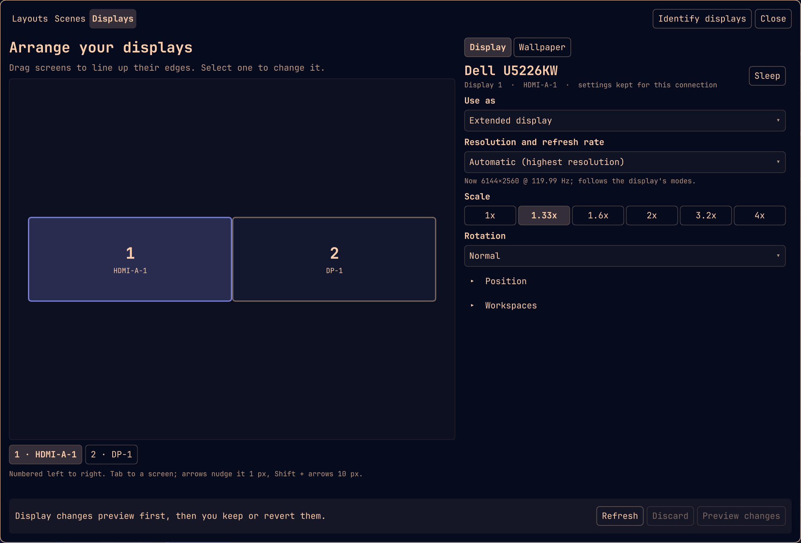

# Displays and workspace placement

Open Hypertile and choose **Displays**; the pane opens from the rail's corner,
with its tabs where the rail's were. The diagram uses logical desktop
coordinates: resolution, rotation, and scale all affect a screen's size. Drag a
screen to align its edges, or open **Position** to enter its X and Y. Changing a screen's
scale, rotation, or resolution moves the screens attached to its right and
bottom edges by the same amount. In a staggered arrangement, remaining
collisions move to the nearest free edge while the edited screen stays in place.
Returning a disabled or mirrored screen to Extended keeps its previous position
when free, or finds free space if another display now occupies that position.



Screens are numbered by
position, left to right and then top to bottom, so the number on a screen says
where it stands; members of a mirror group keep their relative numbers, and disconnected or
disabled displays come last. Tab to a diagram screen and use arrows to move one
logical pixel, or Shift+arrows for ten. **Identify displays** labels every
screen with its number for a few seconds, with the selected screen highlighted;
`hypertile-ctl display identify` does the same, or labels one screen when given
a connector. Closing with unsaved changes asks before discarding them; nothing is
applied until you preview.

Select a screen to change it. The inspector leads with the display's name (make
and model, with its number and connector under it) and **Sleep**, then **Use
as**, resolution and refresh rate, scale, and rotation; **Position** and
**Workspaces** are collapsed below. Longer explanations are in the buttons'
tooltips. The mode picker lists the modes reported by Hyprland and
**Automatic (highest resolution)**. Automatic lets Hyprland select from the
display's current modes, including after docking or changing picture-by-picture
inputs. Existing automatic choices, such as the display's preferred mode,
remain available. Choose a specific resolution and refresh rate to keep a
fixed mode or refresh-rate cap. Moving, scaling, or rotating a screen preserves
its mode choice; saving an automatic mode never pins its current pixel size.
The automatic mode's displayed size is an estimate. Preview checks the mode and
scale Hyprland actually selects, including a supported fallback, and reverts if
the resulting arrangement overlaps. Keep saves the automatic choice and the
resolved preview. If the mode changes again before Keep, start a fresh preview.

Displays whose edges touch keep that relationship when their logical size
changes outside the editor, including full-width/PBP input switches. Top,
bottom and center alignment are retained; a staggered edge keeps its offset.
The display service waits for the outputs to settle before moving them. It
keeps intentional gaps fixed, excludes disabled and mirrored outputs, and
retains missing displays' relationships for reconnect. If resizing an uneven
grid creates a conflict, it uses the closest free position. Only a display with
its own connector rule in `monitors.lua` is moved: Hyprland can change a
position alone only in such a rule. A display placed by a `desc:` or fallback
rule stays where that rule puts it, and its neighbours follow it. An output
with a matching rule in another loaded module also stays fixed, so a position
adjustment cannot revive a shadowed mode or scale. The diagram refreshes
automatically while there are no unsaved edits and no field or list
is in use.

Saved screens that are disconnected remain visible, with their preferences retained.
If screens report the same identity, explicitly match each connector before
applying. Hypertile does not guess which identical screen should inherit a
saved configuration.

To forget a disconnected screen, select it and choose **Forget this display**.
Removal saves immediately and refreshes the list; there is no preview or
confirmation countdown. Unrelated unsaved edits remain in the pane.
Connected screens, including disabled or sleeping outputs,
must be disconnected before their saved profile can be removed; use **Use as →
Disabled** to turn off a connected screen.

Disabling a display moves all its workspaces and their windows to an awake
extended display before turning it off, including named workspaces and
scratchpads. Saved workspace preferences remain intact. Revert returns the
workspaces to their previous displays; Keep leaves them on the enabled display.

Removal clears the screen's saved settings, startup workspace, monitor layout
default, and workspace placement preferences. Workspace layouts, windows, scenes,
and separately saved wallpaper groups remain. Its specific declarations in
`monitors.lua` are removed, preserving the fallback rule and unrelated settings.
Shared description rules and remaining mirror dependencies block removal with an
explanation. Choose another mirror source first. When a connected display is
being saved as Extended but its connector rule still mirrors the absent screen,
removal clears that stale reference and keeps its current position in the same
save. If the screen or another screen using its connector reconnects before
saving, removal is rejected. Reconnecting
after removal discovers the screen again using the remaining monitor rules.

Choose **Preview changes**, then **Keep changes** within 15 seconds. The
countdown starts once every display has settled on the new settings, not when
the first one starts changing. Enter keeps; Escape reverts and leaves the pane
open. **Revert**, closing during preview, or letting the countdown expire
restores the previous arrangement and workspace placement where possible. A separate watchdog runs
outside the overlay and display watcher. Confirmation is required even when
only workspace or layout preferences change. Unsupported modes and overlapping
independent screens produce an error before application.

Unchanged displays are left alone during preview. If a display disconnects,
is replaced, or reports different available modes during the operation,
Hypertile stops and asks you to refresh before trying again. Revert restores
settings only to displays whose identity and modes still match; it does not
send an old full-screen mode to a display that has switched to picture-by-picture.
These checks reduce unnecessary mode changes, but cannot recover a graphics
driver that stops responding while a mode change is already in progress.

## Mirroring

Select a display and choose **Use as → Mirror display …** to duplicate an
independent display. **Extended display** restores its separate desktop and
previous position; **Disabled** removes it from the desktop. Sleep remains a
separate temporary action.

The diagram groups mirrors with their source (for example, **1 + 2**). Select
individual physical displays from the list to change resolution and refresh.
Mirrors have no independent desktop position, initial workspace, or default
layout. Their saved workspace assignments temporarily use the source; their
independent preferences remain available when returning to Extended.

A mirror source must be connected, enabled, and independent. Multiple displays
can mirror one source, alongside other extended displays. Self-mirroring,
chains, and cycles are rejected. Different aspect ratios may stretch the image;
mirroring does not render extra detail for a higher-resolution target.

Mirroring uses the same preview countdown, Keep, and rollback as other display
changes. Keep writes the `mirror` field into the existing Lua declaration.
Returning to Extended explicitly clears that field. Recovery establishes source
displays first and keeps a remaining output usable if a source disappears.

### Size the shared desktop for another display

Once a mirror group is set up, select one of its physical displays in the list
and choose **Use this display**. The same windows and workspaces move to that
display and fit its configured resolution and scale. Each output keeps its own
resolution, refresh rate, scale, and rotation. The other group members receive
a scaled copy; they do not render an independent desktop at their own resolution.
Different aspect ratios may stretch the mirrored image.

**Desktop sized for display …** and **in use** identify the active source.
Selecting a display in the diagram or list only opens its settings. Group
members keep their relative numbering when switching its source.

Switching applies and saves immediately, without another Keep prompt.
**Switch back to …** returns to the previous source. The same recoverable
transaction and independent watchdog protect application and saving; a failure
restores the previous arrangement where possible. Complete or reset pending
display and wallpaper edits first. Sleeping outputs must be woken before using
them as the active display.

All workspaces currently on the old source follow it, including workspaces
without saved placement preferences. The visible workspace and focused window
are retained. Explicit layouts and scene assignments travel with their workspace;
inheriting workspaces use the active monitor's layout default. Other extended
displays keep their content and positions. If the larger desktop would overlap
one, the mirror group moves to the nearest free position. Saved placement and
Extended-position preferences are retained.

For keyboard use, `hypertile-ctl display use-display next` cycles the focused
mirror group through its awake members. Bind this command to a shortcut if
desired. `hypertile-ctl display use-display DP-2` selects a specific connector.
Both commands save immediately; run the command again with the previous
connector to switch back. An extended display outside a mirror group cannot be
selected with this command.

## Sleep and disable

**Sleep**, beside the display's name, turns off the output using DPMS without
changing its workspace placement. If the overlay is on that display it moves to
another awake display first, so its Wake button stays visible. The same button
reads **Wake** while the output is asleep;
it follows the compositor's power state, not unsaved edits, so it is only
offered for a connected, enabled output. Sleeping displays are marked in the
diagram and the display list, and **Wake all** appears in the header only while
something is asleep. `hypertile-ctl display wake` also powers outputs back on.
Hyprland treats DPMS as one global state, so after any output sleeps its
`key_press_enables_dpms` and `mouse_move_enables_dpms` options (both on in
Omarchy) would wake every output on the next key press or mouse move. While
another output stays awake, the service holds both options off; sleeping the
last awake output instead enables keyboard wake, so a key press remains a way
back. The original values are restored once every output is awake, however it
woke, and re-asserted after a config reload. Sleep is temporary and is never
saved as a disabled display.

**Disable display** removes an output from the desktop after other destinations
are enabled. Its workspaces remain accessible on another output. Disabling the
last usable output is rejected. Re-enabling uses the saved settings, subject to
hardware availability. Displays disabled at startup retain their saved mode,
scale, rotation, and position; a newly discovered disabled output starts with
an advertised mode. Re-enabling a previously sleeping output also wakes it.
Wake an already enabled sleeping destination before disabling the last awake
extended display, so the preview controls remain accessible. If the awake
output disappears while another sleeps, keyboard wake is enabled automatically.

## Show a workspace

Select an extended display, open **Workspaces**, and choose a workspace under
**Show a workspace here**, then **Show**.
The picker lists workspaces 1–10 and existing or saved workspaces, with the current
connector beside live workspaces. **Other workspace…** accepts a new number or a
name such as `name:research`. Show switches immediately, moving an existing
workspace and its windows to this display if necessary. The previously visible
workspace remains available. This does not change saved placement preferences.
Show is unavailable during a display preview or for sleeping, disabled,
disconnected, or mirrored outputs.

Turn on **Start on this workspace**, then **Preview changes → Keep changes**
to save the startup preference. Turn it off while that workspace is selected to
clear it. Startup workspaces must be unique across displays and cannot conflict
with a saved workspace assignment.

## Workspaces that live on a display

The same **Workspaces** group (collapsed until opened) sets the display's
default layout and lists **Workspaces that live here**.

Add a numbered workspace, or a named workspace using `name:research`, to place
it on the selected screen. The Add button waits until the entry is a valid
selector and says why otherwise. The workspace need not exist yet. Keep moves an existing
workspace immediately; the preference also applies at startup and when the
preferred output returns. Moving a workspace normally does not rewrite this
preference or cause Hypertile to move it back continuously.

While a preferred output is absent, workspaces stay usable elsewhere. A later
manual move while it is absent suppresses automatic return until the assignment
is explicitly reapplied or a new compositor session begins. Reconnect does not
select the returning workspace or relaunch scene applications.

Initial workspace preferences apply at startup and are coordinated with session
restoration. Set them with **Start on this workspace** above. Config reload and
monitor reconnect preserve the user's focus.

## Layout inheritance

The **Default layout on this display** applies to inheriting workspaces,
including future ones; **The default layout** (the global one) is its own
fallback. An explicit workspace layout takes precedence and follows that
workspace when moved. **Display default** in a workspace's row clears the
explicit override.

The Layouts rail's **Apply to** section shows both the effective layout and
its source, and does the same for open workspaces at once. Cycling or choosing
a layout makes the choice explicit. Existing saved workspace layouts remain
explicit on upgrade. **Every workspace on …** remains a one-time assignment to
current workspaces; it does not set a persistent display default.

An active scene retains its required layout. To replace it with a conflicting
layout, use the Layouts view's existing replacement confirmation first. Moving
a scene workspace does not replace its layout or launch its apps again.
Renaming layouts updates display references. Deleting a display default is
refused until another default is chosen.

## Configuration ownership and recovery

Hypertile automatically uses the existing `~/.config/hypr/monitors.lua` as the
display configuration when installed or enabled. No takeover choice is needed,
and initial setup does not change your display arrangement. The UI starts from
the running settings. Preview changes are temporary; **Keep changes** saves the
adjusted fields into the existing monitor declarations, reloads Hyprland, and
verifies the result. A failed save or reload restores the previous file and
runtime arrangement.

Comments, unrelated fields, the general fallback rule, and unchanged expressions
such as `preferred`, `auto`, and shared scale variables are preserved. A screen
without a specific rule gets one when its settings change, inheriting fallback
expressions. Changing one screen's scale never changes a shared scale variable.
The first save keeps `monitors.lua.hypertile.bak`; each preview also journals the
exact pre-save content for crash recovery. External edits during preview cause
the save to stop and ask you to refresh, rather than overwrite them.

Configuration reloads and reconnects use Hyprland's saved mode, scale, rotation,
power and mirroring rules. Hypertile remembers the confirmed adjoining edges
in a separate placement journal and adjusts positions using the current sizes;
it never replays old resolutions during this adjustment. A position you edit
in the configuration moves that display in the remembered arrangement; the
other displays keep their edges. Keep saves the positions shown in the preview,
adjusted ones included, so its reload does not move a display back.
Display previews suspend this adjustment until Keep or Revert finishes.
Disabling or uninstalling Hypertile leaves the last saved monitor configuration
usable, including on purge; automatic edge adjustment requires its service.
Existing saved preferences from the earlier display implementation are migrated
once on upgrade before the old mode replay behavior is retired.

Supported edits are literal `hl.monitor({ ... })` declarations in `monitors.lua`.
The declaration edited for an output is the one Hyprland applies: a `desc:`
selector matches a prefix of the description, and when several declarations
match one output the last one in the file wins, so a partial description rule
keeps its other fields (such as `vrr`) instead of being shadowed by a new rule.
Custom control flow, computed output selectors, duplicate declarations, or
monitor rules in other loaded user modules receive a source-specific explanation
before preview changes are applied. They are never rewritten speculatively.
Workspace policy remains separate from monitor geometry. Known connected outputs
are matched by connector automatically, including connections sharing an EDID;
reassigning a disconnected saved display still uses the explicit matching UI.

Display state lives in `$XDG_STATE_HOME/hypertile/displays/` (normally
`~/.local/state/hypertile/displays/`):

- `confirmed.json`: versioned workspace/display identity metadata and the
  configuration migration marker; geometry is informational after migration.
- `pending.json`: an unconfirmed transaction, original geometry and workspace
  placement, its token, deadline, and application progress.
- `workspace-runtime.json`: current-session reconnect and manual-move tracking.
- `recovery.json`: the most recent rollback result, including external changes,
  unavailable hardware, and fallback recovery errors.

Settings are written atomically. A pending transaction never becomes startup
intent without Keep. Session saves pause during preview. Startup restores
confirmed display intent before recovering windows and scenes. A changed
external configuration is detected during rollback and is not blindly replaced.
If hardware disappears, recovery keeps an available output usable and reports
any fallback.

Ordinary upgrades and uninstall preserve preferences and recovery state.
`uninstall.sh --purge` removes this state along with the other Hypertile user
state. Uninstall first stops display management and rolls back an active preview.

## CLI

All display commands return JSON and use the same service as the UI:

```sh
hypertile-ctl display list --json
hypertile-ctl display status
hypertile-ctl display preview --json - < settings.json
hypertile-ctl display keep TOKEN
hypertile-ctl display revert TOKEN
hypertile-ctl display show-workspace HDMI-A-1 1
hypertile-ctl display use-display DP-2
hypertile-ctl display use-display next
hypertile-ctl display remove-display SAVED_DISPLAY_ID
hypertile-ctl display sleep DP-1
hypertile-ctl display wake DP-1
hypertile-ctl display wake
hypertile-ctl display restore
hypertile-ctl display recover
```

`restore` recovers interrupted work and reconciles workspace preferences;
monitor geometry comes from the Lua configuration. `recover` rolls back an
interrupted preview. `watch` is the long-running display watcher: it listens to
Hyprland's event socket and consults the compositor only when a workspace or
output event arrives, every five seconds as a safety net, or while an output
sleeps, and it rewrites its runtime file only when something changed. `stop`
stops it after recovery. The former `--takeover` flag remains accepted for script
compatibility and is no longer necessary. The UI also displays per-output
identify labels.

A settings document has `version: 1`, a `displays` array, and a `workspaces`
object. Start from `display list` rather than inventing display identities.
Each display has `id`, `identity`, `connector`, `enabled`, `width`, `height`,
`refresh`, `scale`, `transform`, `x`, and `y`. Optional preferences are
`default_layout`, `initial_workspace`, `explicit_match`, and `mirror_of` (a saved
display ID, or `null` for Extended). `extended_position` retains `{ "x": …,
"y": … }` for returning from mirroring. `mirror_connector` is runtime readback;
preview resolves connectors from `mirror_of` rather than trusting that field. Workspace entries
use selectors as keys and `{ "monitor": "saved-display-id", "layout": null }`
as values; `null` inherits, while a layout string is explicit. Custom layouts
use the `lua:` prefix. Display transforms use Hyprland's values 0–7.

Use `display remove-display SAVED_DISPLAY_ID` to forget a disconnected profile
immediately. The service reads current settings, clears its workspace placement
references, and saves without previewing geometry. Save failures restore the
profile and its configuration; reconnecting before the save rejects removal.

For scripted settings transactions, add disconnected display
IDs to `removed_displays` and omit them from `displays`. Clear their workspace
`monitor` references to `null`, retaining each workspace's `layout`. Resolve any
`mirror_of` references first. Removal uses the same preview/keep/revert transaction;
omitting a display alone does not delete its Lua declarations.

See [display validation](diagnostics/displays/README.md) for the tested software,
hardware, and remaining physical verification limits.

## Wallpaper groups

Choose **Wallpaper** in the **Display | Wallpaper** switch at the top of the
inspector. Select a screen, choose **Span displays**, and pick the other
displays that should share that image. Group members are highlighted in the
diagram. Select a third screen and keep **This display** for an independent
wallpaper. Independent screens following the theme repeat the image on each
screen.

Each group can use **Theme wallpaper** or **Custom image** (type a path or
**Choose…**) for a fixed image that does not change with the theme. **Fill**
covers the screen or group, cropping the edges; **Fit** preserves the entire
image with black borders as needed.
**Apply wallpaper** saves all wallpaper edits immediately, once a spanning
group has at least two displays and a custom image has a file. This is separate
from display geometry's Preview/Keep. Unsaved wallpaper edits are retained while
selecting other monitors; closing asks before discarding them.

A display belongs to one group. Adding it to another group removes it from its
old group; a group left with one display becomes independent. Spans follow the
logical desktop arrangement, including vertical offsets and mixed scales.
Missing outputs are excluded from the visible span and rejoin on reconnect.
Connectors identify group members, so using a different port requires updating
the group. Mirrored outputs use their source's wallpaper. If a custom file is
later removed or fails to load, the renderer falls back to the theme image.

Settings live in `~/.config/omarchy/wallpaper.json` (or `$XDG_CONFIG_HOME`). The
first Apply clones `omarchy.background` using Omarchy's supported clone command
and adds group rendering to that user-owned clone. Packaged Omarchy files remain
untouched. Theme transitions and background-selection shortcuts remain available.
First-time setup and renderer updates briefly restart the shell to load the new
renderer; ordinary wallpaper changes apply live. Finish any pending display
changes before applying wallpaper.
Hypertile refuses to overwrite an existing custom clone or locally edited
renderer. Subsequent Apply operations update an unmodified managed clone when
needed. The original renderer is retained as `Background.omarchy.qml.bak`.
The adapter supports both the original image renderer and the newer
`BackgroundMedia` renderer. On the newer renderer, images wait for their native
dimensions and decode for the display or span; small images are not enlarged
in memory. Temporary transition images are released even when a group keeps
the same custom image through a theme change.

The clone and wallpaper preferences are independent user customizations and
remain usable if Hypertile is disabled or uninstalled. To return to stock
rendering, disable `<username>.background` through Omarchy's plugin controls;
Omarchy restores its original background plugin. Preferences remain available
for later use.

CLI: `hypertile-ctl display wallpaper` reads preferences. To apply, pass
`--json` with `{"previous": <last-read-settings>, "settings": <new-settings>}`.
Settings have `version: 1` and `groups`, whose entries contain `outputs`
(connector names), `mode` (`span` or `repeat`), `image` (absolute path or `null`
for the theme), and `fit` (`crop` or `fit`). Concurrent edits are rejected.
